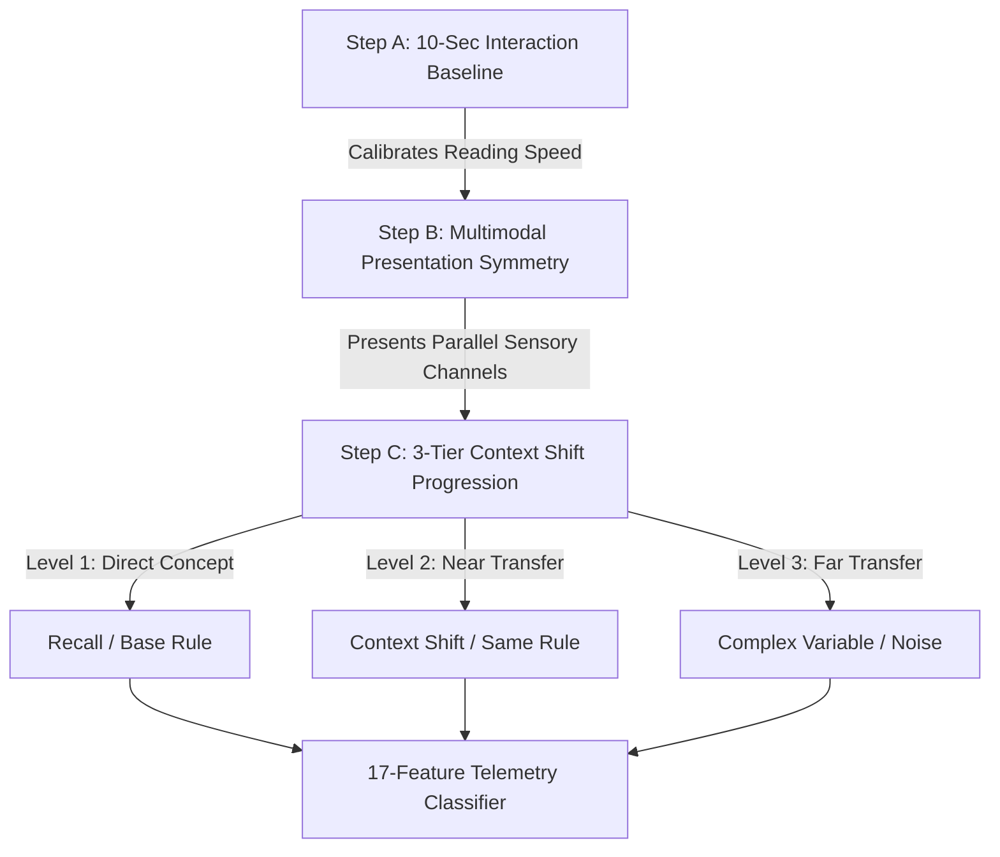

# 🧠 AI Master Context: Multimodal Cognitive Profiling Engine

---

## 1. System Vision & The Core Objective

We are building an **intelligent, automated diagnostic assessment engine** that profiles a user's true cognitive learning style and decision-making behavior in real time. Instead of relying on traditional, easily gamed quiz scores or rote memorization, this system captures **17 high-resolution behavioral telemetry and cognitive features** during a compact, adaptive testing session.

The engine processes these telemetry signals to classify users into one of **8 behavioral & cognitive archetypes**:

1. `quick_careless` — **Quick but Careless** ⚡
2. `slow_thorough` — **Slow but Thorough** 🐢
3. `concept_struggler` — **Concept Struggler** 😰
4. `fast_learner` — **Fast Learner** 🚀
5. `inconsistent_performer` — **Inconsistent Performer** 🎲
6. `steady_achiever` — **Steady Achiever** 📈
7. `strategic_thinker` — **Strategic Thinker** 🎯
8. `ignorant_avoider` — **Ignorant / Avoider** 🙈

---

## 2. Core Architecture: The 17 Telemetry Features

The system actively tracks, records, and evaluates these 17 features across the PostgreSQL database, the machine learning classifier, and the user interface:

### ⏱️ Timing & Pacing Features (6)
- **`avgResponseTime`**: Mean active decision time (in seconds) spent per question.
- **`avgTimeToStart`**: Initial hesitation gap or planning latency before the user's first click or keystroke.
- **`timeVariance`**: Coefficient of variation ($\text{CV} = \frac{\sigma}{\mu}$) measuring pacing consistency across questions.
- **`rushedDecisions`**: Count of questions submitted in under 15 seconds.
- **`overthinkingCount`**: Count of questions where the student spent excessive time hesitating ($> 60\text{s}$).
- **`overtimeCount`**: Number of questions where time exceeded the recommended challenge limit.

### 🔄 Behavioral Telemetry (7)
- **`totalAnswerChanges`**: Number of option revisions or mind-changes before submission.
- **`backtrackCount`**: Count of backward question navigations to review or alter answers.
- **`confidence`**: Behavioral confidence rating ($1.0 - 10.0$) derived implicitly from speed, accuracy, and revisions.
- **`totalResponseLength`**: Character count across open-ended written responses.
- **`skippedQuestions`**: Count of blank or unattempted questions.
- **`decisionStyle`**: Categorical classification (`impulsive`, `balanced`, or `deliberate`).
- **`accuracyScore`**: Task performance accuracy ratio ($0.0 - 1.0$).

### 🧠 Cognitive Extraction (4)
- **`reflection_depth`**: $0.0 - 1.0$ score evaluating metacognitive depth, causal connectives, and trade-off analysis.
- **`self_awareness`**: $0.0 - 1.0$ score measuring risk awareness, caution under pressure, and mistake recognition.
- **`learning_orientation`**: $0.0 - 1.0$ score measuring preference for information seeking vs. blind guessing.
- **`creativity_score`**: $0.0 - 1.0$ score evaluating resourcefulness and non-generic problem solving.

---

## 3. The Two System Bottlenecks We Solved

To prevent false-positive data and artificial errors, the AI explicitly engineers around two major behavioral traps:

### 1. The Prior-Knowledge / Familiarity Trap
- **The Problem**: If a user already knows a specific topic, they bypass **Knowledge-Based Behaviour (KBB)** and execute automated muscle memory (Rule-Based Behaviour). The system would incorrectly flag them as a "Fast Learner."
- **The Solution**: All assessment modules generate **novel, abstract, or fictional scenarios** (e.g. imaginary logic grids, symbolic alien languages, novel business crises) to eliminate prior memorization advantages.

### 2. The Interface Barrier / Slow Reader Trap
- **The Problem**: If a user understands concepts brilliantly but reads text slowly, their high latency metrics will cause the system to misclassify them as a "Slow Learner" or "Concept Struggler."
- **The Solution**: The system calculates a **Personalized User Speed Multiplier** during a 10-second baseline interaction, normalizing timing thresholds (`avgResponseTime`) to isolate pure cognitive adaptation from reading speed.

---

## 4. The Solution: The 3-Step "Trojan Horse" Delivery Framework

To isolate pure cognitive adaptation, generated assessment modules follow this 3-step structural logic:



### Step A: The 10-Second Modality & Interaction Baseline
- **Mechanism**: Before content begins, prompt the user with a simple 1-sentence visual interaction task (e.g., clicking a specific shape or color).
- **System Fix**: Measure response latency to establish the user's baseline interaction speed. Scale timing thresholds (`avgResponseTime`) accordingly.

### Step B: Multimodal Presentation Symmetry
- **Mechanism**: All instructional inputs and questions present information simultaneously across parallel channels (concise text + clean structural flowcharts/diagrams + audio/visual bullet points).
- **System Fix**: Maintain identical text-to-visual ratios across all levels. Never test a concept taught visually with a wall of raw text.

### Step C: The 3-Tier Context Shift Progression

1. **Level 1 (Direct Concept / Recall)**:
   - Teaches the core rule using an immediate visual example and asks the user to apply it directly.
   - *Diagnostic Role*: Distinguishes fast processors from slow processors.
2. **Level 2 (Near Transfer / Context Shift)**:
   - Preserves the exact underlying logic rule but completely swaps the scenario and visual skin.
   - *Diagnostic Role*: Exposes the **Superficial Mimic** who memorized vocabulary patterns rather than underlying principles.
3. **Level 3 (Far Transfer / Complex Variables)**:
   - Introduces structural noise, a hidden variable, or alters a key constraint.
   - *Diagnostic Role*: Differentiates the **Strategic Thinker** (whose `avgTimeToStart` spikes for analytical processing) from the **Thorough Ignorer** (who repeats previous mistakes).

---

## 5. Knowledge-Based Behaviour (KBB) & Rasmussen's SRK Framework

Cognitive styles reflect how individuals handle novel situations without pre-learned habits:

```
[Phase 1: Input & Echo] ----> [Phase 2: Context Shift] ----> [17-Feature Classifier Engine]
 (Give Theory + Base Test)      (Apply Rule to New Domain)      (Analyze Latency vs. Accuracy)
```

| Cognitive Style | KBB Definition | Phase 1 Performance | Phase 2 Accuracy | Phase 2 Latency | Primary System Trigger |
| :--- | :--- | :--- | :--- | :--- | :--- |
| **Fast Learner** | Formulates accurate mental models rapidly with minimal data points. | Fast & Accurate | High | Low | Successful abstract theory transfer. |
| **Slow Learner** | Requires dense, serial data streams; processes via step-by-step deduction. | Slow & Accurate | High | High | High latency with logical accuracy. |
| **Thorough Ignorer** | Actively rejects new data; forced confirmation bias. | Variable | Zero | High | Repetitive error loops; ignores feedback. |
| **Superficial Mimic** | Confuses rule-based memorization with knowledge-based understanding. | Fast & Accurate | Zero | Low | Instant failure upon changing context. |

---

## 6. Idioms, Terminology & Conceptual Distinctions

### Terms for Quick Responders
- **Quick on the draw / Quick on the trigger**: Prompt with fast, accurate solutions.
- **Quick study**: Absorbs new knowledge efficiently and applies it in real time.
- **Cognitive fluency**: Ease and speed with which the brain formulates accurate responses.
- **Intellectually agile**: Rapid movement from hearing a concept to producing smart applications.

### Memorization vs. True Learning

> [!IMPORTANT]
> **True Fast Learners** can explain their reasoning and adapt instantly when scenario variables change.
> **Memorizers** exhibit high speed on identical tasks, but collapse or stall when context shifts.

---

## 7. System Logic Flow & Classification Algorithm

```
                  [Level 1: Fast & Correct] 
                              │
  ┌───────────────────────────┼───────────────────────────┐
  ▼                           ▼                           ▼
[Level 2: Fast & Correct]   [Level 2: Slow & Correct]   [Level 2: Fast & Wrong]
  │                           │                           │
  ▼                           ▼                           ▼
[Level 3: Fast & Correct]   [Level 3: Slow & Correct]   [Level 3: Fast & Wrong]
  │                           │                           │
  🕒 Low Latency              🕒 High Latency             ❌ Same Error
  ▼                           ▼                           ▼
🧠 Fast Learner             🐢 Slow Learner             🎭 Superficial Mimic
```
