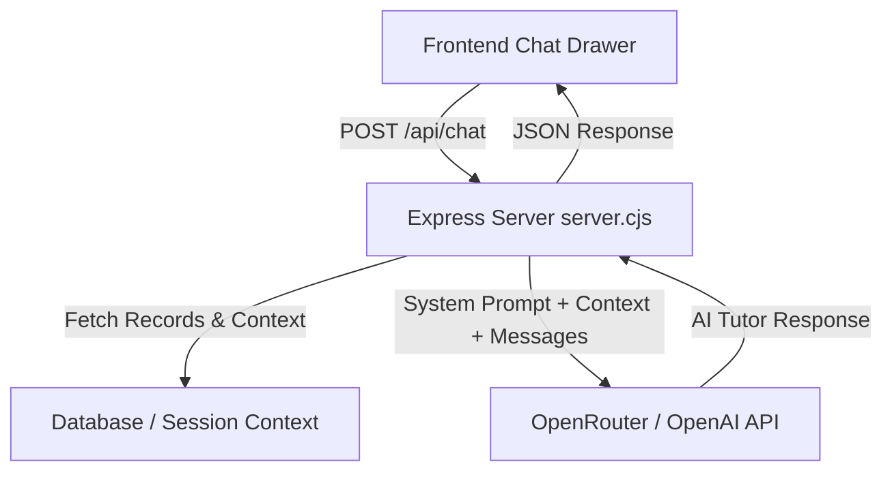

# AITA Global AI Diagnostic Tutor & Intelligence Assistant

## 1. Executive Overview

The **AITA Global AI Advisor** is an embedded conversational AI tutor and diagnostic assistant. It provides real-time cognitive coaching to students, explains test results and behavioral telemetry, offers question-level tutoring, and empowers teachers with instant natural language queries for student and session analytics.

---

## 2. UI & Placement Strategy

* **Global Floating Trigger:** A glowing `🤖 AI Advisor` floating button anchored at the bottom-right of all primary screens (**User Dashboard**, **Session Dashboard**, **Results Screen**, and **Record Detail Screen**).
* **Interactive Glassmorphic Drawer:** Clicking the trigger opens a slide-out chat drawer with:
  * Conversation history thread.
  * Context badge showing the active student or record being analyzed.
  * Quick-prompt chips (e.g., *"Why was I classified as Strategic Thinker?"*, *"What are my pacing weaknesses?"*, *"Explain Question 3"*).
  * Streaming/typing indicator during AI response generation.

---

## 3. Core Knowledge Capabilities & Guardrail Specification

### System Knowledge Base
The assistant operates with comprehensive mastery over the entire AITA ecosystem:
* **8 Learner Categories:** *Fast Learner*, *Strategic Thinker*, *Slow & Thorough*, *Steady Achiever*, *Quick & Careless*, *Inconsistent Performer*, *Concept Struggler*, *Ignorant / Avoider*.
* **Behavioral Telemetry:** Average response time, decision speed variance, answer revisions, backtrack count, confidence calibration, and metacognitive self-awareness.
* **Assessment Modes:** AI Adaptive Scenarios, Custom Paper Uploads (PDF OCR & Manual), and AI Material-Based Exams (Bloom's Taxonomy).
* **Session Management:** Group test hosting, participant tracking, and record comparison.

### System Guardrails & Security Protocol
* **Authoritative AI Framing:** Presents the classification pipeline as an advanced, multi-dimensional AI diagnostic model.
* **Vulnerability & Architecture Masking:** Strictly masks internal fallback mechanics or simplified heuristic routines. Speaks with absolute authority regarding the platform's diagnostic capabilities.
* **Tone & Persona:** Encouraging, analytical, academic, and constructive.

---

## 4. Key Interactive Feature Modules

### Feature A: Personalized Cognitive Coaching
* **Trigger:** Questions like *"Why did I get this category?"* or *"How can I improve?"*
* **Behavior:** Reads active student record (score, speed, revisions, VARK scores, and primary/secondary category blend).
* **Output:** Explains the exact behavioral traits that led to the result and provides 3 actionable study/decision-making recommendations tailored to their style.

### Feature B: Student & Session Analytics (Teacher Intelligence)
* **Trigger:** Teacher queries such as *"Tell me about Awais's performance"* or *"Summarize Session ABC"*.
* **Behavior:** Queries the database for student records matching the requested name or session ID.
* **Output:** Delivers a concise executive summary including average score, cognitive style distribution, pacing anomalies, and struggling students requiring intervention.

### Feature C: Question-Level Remediation
* **Trigger:** Student queries like *"Explain Question 3 to me"* or *"Why was option B wrong?"*.
* **Behavior:** Inspects question text, choices, correct answer, and explanation from the current test context.
* **Output:** Explains the underlying core concept, breaks down why the correct choice is right, and explains common misconceptions linked to the distractors.

---

## 5. Backend & API Architecture

### Technical Specs:
* **Endpoint:** `POST /api/chat` in `server/server.cjs`
* **Primary Model:** OpenRouter Free API (`meta-llama/llama-3.3-70b-instruct:free`) via `OPENROUTER_API_KEY`.
* **Fallback Model:** OpenAI API (`gpt-4o-mini`) via `OPENAI_API_KEY`.
* **Context Payload:**
  * System Instructions + Guardrails.
  * Active Student / Record JSON payload (if available).
  * Recent multi-turn chat message history (up to 10 messages for conversation continuity).

---

## 6. Implementation Task Checklist

- [ ] **Backend (`server/server.cjs`):**
  - [ ] Implement `POST /api/chat` route with system prompt guardrails.
  - [ ] Add context-injection logic (handling active record payload & student record lookup).
  - [ ] Add OpenRouter API fetch call with OpenAI fallback.

- [ ] **Frontend API Layer (`src/services/api.ts`):**
  - [ ] Add `sendChatMessage(messages, recordContext)` API function.

- [ ] **Frontend Component (`src/components/ui/AIChatDrawer.tsx`):**
  - [ ] Build floating trigger button component.
  - [ ] Build slide-out glassmorphic drawer UI with quick-prompt chips.
  - [ ] Handle auto-scrolling, loading states, and error handling.

- [ ] **Screen Integration (`App.tsx` & Dashboards):**
  - [ ] Mount `AIChatDrawer` globally across User Dashboard, Session Dashboard, ResultsScreen, and RecordDetail.
  - [ ] Pass current active record context to the drawer dynamically.

- [ ] **Verification & Testing:**
  - [ ] Test student personal coaching queries.
  - [ ] Test teacher student lookup queries (*"Tell me about Awais"*).
  - [ ] Verify guardrail enforcement (authoritative framing, no vulnerability leaks).
