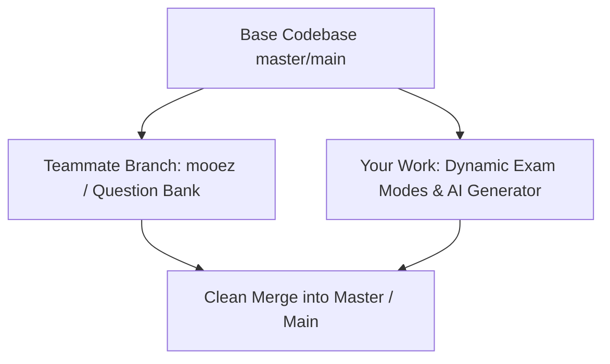

# FYP Dynamic Assessment & Exam Generation Architecture

## 1. Executive Summary & Team Strategy

For the final project defense, the assessment architecture is divided into two streamlined, modular streams to ensure high reliability, zero presentation risks, and maximum examiner impact:

* **Teammate Stream (General Cognitive Bank):** Enhancing the general aptitude/cognitive question bank and validation logic on a dedicated branch (`mooez`).
* **Main System Stream (Dynamic Custom & AI Exam Modes):** Implementing two flexible, dynamic exam creation modes for both Solo Learners and Teacher Sessions that handle dynamic question counts, dynamic mark distributions, Bloom's taxonomy difficulty scaling, and local/free AI document processing.

---

## 2. Assessment Modes Specification

### Mode A: Teacher Custom Paper (Direct Quiz / PDF Upload Entry)
* **Target User:** Educators or users who want to host a pre-made paper from text or uploaded PDF.
* **Mechanism & Document Extraction:**
  * **Text/Digital PDFs:** Extracted locally using `pdf-parse` in Node.js (<100ms processing, 100% free, offline-capable).
  * **Scanned/Image PDFs:** Processed via OpenRouter Multimodal Vision AI (`llama-3.2-11b-vision-instruct:free`) for 99%+ accurate Optical Character Recognition (OCR).
  * **Mark Extraction Precision:** Explicit question marks (e.g. `[2 Marks]`) are parsed automatically. If omitted, the engine applies auto-weighting (1 mark for MCQs, 2-5 marks for analytical items).
  * Behavioral telemetry (time per item, answer revisions, backtrack counts, and confidence ratings) is tracked during execution.

### Mode B: AI Material-Based Exam Generator
* **Target User:** Students or educators looking to test understanding on specific reference materials, notes, or topics.
* **Inputs & Controls:**
  1. **Reference Content / PDF / Topic:** Text or uploaded file material.
  2. **Question Count:** Custom selector (e.g., 5, 10, 15, or 20 questions).
  3. **Mark Distribution:** Standardized total mark target and question weighting.
  4. **Difficulty Calibration (Bloom's Taxonomy Framework):**
     * **Easy (Recall & Fundamentals):** 80% foundational concepts/definitions + 20% direct application.
     * **Normal (Balanced Application):** 50% core concepts + 50% situational scenario application.
     * **Hard (Critical Analysis & Synthesis):** 20% fundamental constraints + 80% complex problem solving, edge-case evaluation, and trade-off analysis.

---

## 3. Cost-Effective AI Infrastructure (OpenRouter Free Tier)

* **Primary AI Engine:** OpenRouter API (`https://openrouter.ai/api/v1`) using top-tier free models:
  * `meta-llama/llama-3.3-70b-instruct:free` (Matches GPT-4o quality on academic exams at $0 cost).
  * `meta-llama/llama-3.2-11b-vision-instruct:free` (For OCR and diagram extraction).
* **Context Capacity:** 131,072 tokens per request (~100 pages of text), far exceeding the 2,000 tokens required for a typical 15-question exam.
* **Cost & Limits:** **100% Free ($0.00)**. Daily quota resets automatically, backed up by local heuristic fallbacks.

---

## 4. Dynamic UI & Engine Architecture

To ensure the interface gracefully adapts to any custom or generated test (whether 3 questions or 25 questions):

1. **Flexible Navigation & Progress Tracking:**
   * Progress Bar calculated as: `(currentQuestionIndex + 1) / totalQuestions * 100%`.
   * Dynamic question navigation grid adapts layout based on `totalQuestions`.

2. **Normalized Behavioral Metrics:**
   * **Pacing Metric:** `Average Response Time = Total Exam Time / totalQuestions`.
   * **Score Calculation:** `Percentage Score = (Obtained Marks / Total Exam Marks) * 100%`.
   * **Cognitive Profile Mapping:** Learner categories (*Steady Achiever*, *Fast Learner*, *Strategic Thinker*, *Slow & Thorough*, etc.) scale relative to percentage score and normalized decision speed per item.

3. **Dynamic Results Summary & Future Diagnostic Chatbot:**
   * Per-question review tables and diagnostic feedback iterate over `questions.map(...)` dynamically regardless of exam length or mark weighting.
   * Future streaming AI diagnostic chatbot hooks into the same OpenRouter free tier for streaming student tutoring chats.

---

## 5. Git Merging & Integration Plan

* **Isolation:** Teammate works inside `src/data/questionBank.ts` / specific question components.
* **Core Enhancements:** AI generation endpoints in `server/server.cjs` and setup UI screens in `src/components/screens/`.
* **Merge Safety:** Non-conflicting file paths ensure automatic, seamless Git merging.

---

## 6. Defense Elevator Pitch for Examiners

> *"Our platform offers dual-layer assessment: standard cognitive profiling alongside dynamic, AI-driven domain testing powered by open-weight LLMs via OpenRouter. Educators can input pre-made papers or generate custom exams from study materials calibrated against Bloom’s Taxonomy. Beyond simple grading, the engine tracks behavioral telemetry—decision speed, answer revisions, and confidence calibration—to deliver a complete multi-dimensional cognitive profile."*
