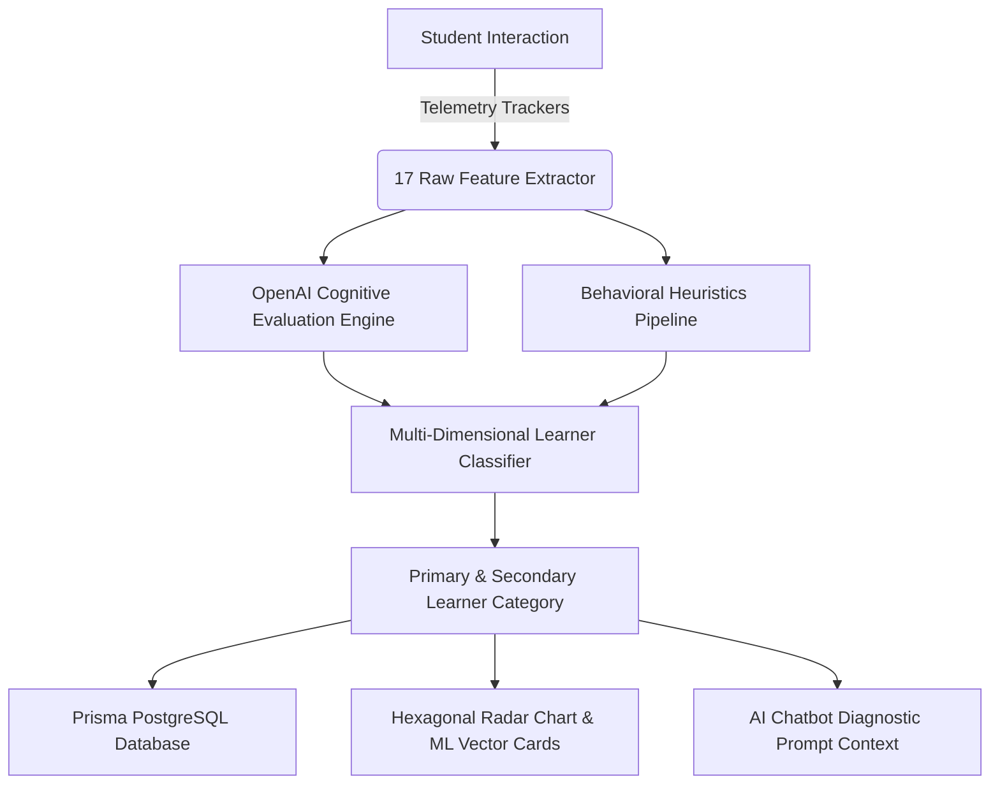

# 🧠 AITA Cognitive Profiling Process & Telemetry Engine

## Executive Overview
The **AITA (Adaptive Diagnostic & Cognitive Profiler)** platform implements a multi-dimensional telemetry tracking and machine learning classification pipeline. The engine evaluates student behavior across **17 distinct telemetry and cognitive features** to classify learners into **8 diagnostic categories**.

---

## 📊 Part 1: The 17 Telemetry & Cognitive Features

### ⏱️ Section A: Timing & Pacing Features (6)

#### 1. `avgResponseTime` (Average Decision Time)
- **Status**: ✅ Implemented
- **Definition**: The mean active decision time (in seconds) spent per question.
- **Measurement Logic**: $\frac{\sum \text{Question MillisecondsSpent}}{1000 \times \text{TotalQuestions}}$
- **System Location**: `useQuizState.ts`, `ResultsScreen.tsx`, DB `Record.avgResponseTime`

#### 2. `avgTimeToStart` (Time to First Interaction)
- **Status**: ✅ Implemented
- **Definition**: Initial hesitation or planning gap before the student makes their first click or keystroke on a question.
- **Measurement Logic**: $\text{Timestamp}_{\text{FirstInteraction}} - \text{Timestamp}_{\text{QuestionShown}}$
- **System Location**: `QuestionTypes.tsx`, `RecordDetail.tsx` (ML Feature Vector table)

#### 3. `timeVariance` (Pacing Consistency Ratio)
- **Status**: ✅ Implemented
- **Definition**: Coefficient of variation ($\text{CV} = \frac{\sigma}{\mu}$) measuring pacing stability across test rounds.
- **Measurement Logic**: $\frac{\sqrt{\frac{\sum (t_i - \bar{t})^2}{N}}}{\bar{t}}$
- **System Location**: `classifyLearner.ts`, `RecordDetail.tsx`

#### 4. `rushedDecisions` (Impulsive Choice Count)
- **Status**: ✅ Implemented
- **Definition**: Count of questions submitted in under 15 seconds.
- **Measurement Logic**: Increments when per-question $t_i < 15\text{s}$.
- **System Location**: `useQuizState.ts`, `classifyLearner.ts`

#### 5. `overthinkingCount` (Hesitation Count)
- **Status**: ✅ Implemented
- **Definition**: Count of questions where the student spent excessive time deliberating.
- **Measurement Logic**: Increments when per-question $t_i > 60\text{s}$.
- **System Location**: `useQuizState.ts`, `classifyLearner.ts`

#### 6. `overtimeCount` (Timer Overrun Count)
- **Status**: ✅ Implemented
- **Definition**: Count of questions exceeding the challenge time limit.
- **Measurement Logic**: Increments when per-question $t_i > \text{timeLimit}$.
- **System Location**: `useQuizState.ts`, `server.cjs` (Chatbot Diagnostic Context)

---

### 🔄 Section B: Behavioral & Telemetry Features (7)

#### 7. `totalAnswerChanges` (Answer Revisions)
- **Status**: ✅ Implemented
- **Definition**: Total times a student revised or changed their selected option before submitting.
- **Measurement Logic**: Increments on option click/change event per question.
- **System Location**: `ResultsScreen.tsx`, `RecordDetail.tsx`, DB `Record.overall`

#### 8. `backtrackCount` (Question Navigation Backtracks)
- **Status**: ✅ Implemented
- **Definition**: Total times the student navigated backward to edit a previous question.
- **Measurement Logic**: Increments on clicking the `Back` navigation button.
- **System Location**: `useQuizState.ts`, `classifyLearner.ts`

#### 9. `confidence` (Implicit Behavioral Confidence Rating)
- **Status**: ✅ Implemented
- **Definition**: Behavioral certainty score (1–10 scale) derived automatically without self-report sliders.
- **Measurement Logic**: Baseline $6.0 + \text{PacingBonus} + \text{LowRevisionBonus} + (\text{Accuracy} - 0.5) \times 4 + \text{ReflectionBonus}$.
- **System Location**: `classifyLearner.ts`, `ResultsScreen.tsx`, Hexagonal Radar Chart, DB `Record.confidence`

#### 10. `totalResponseLength` (Written Response Volume)
- **Status**: ✅ Implemented
- **Definition**: Total character count across typed short/long/reflection questions.
- **Measurement Logic**: $\sum \text{String.length}(\text{textAnswers}_i)$
- **System Location**: `useQuizState.ts`, `classifyLearner.ts`

#### 11. `skippedQuestions` (Skipped Question Count)
- **Status**: ✅ Implemented
- **Definition**: Count of blank or unattempted questions upon test completion.
- **Measurement Logic**: Count of items where answer is `null`, `""`, or `[]`.
- **System Location**: `detectSkippingBehavior()`, DB `Record`

#### 12. `decisionStyle` (Behavioral Archetype)
- **Status**: ✅ Implemented
- **Definition**: Categorical decision archetype: `impulsive`, `balanced`, or `deliberate`.
- **Measurement Logic**: `avgResponseTime < 25s` $\rightarrow$ `impulsive`; `> 60s` $\rightarrow$ `deliberate`; else `balanced`.
- **System Location**: `classifyLearner.ts`, `RecordDetail.tsx`, DB `Record.decisionStyle`

#### 13. `accuracyScore` (Overall Task Accuracy)
- **Status**: ✅ Implemented
- **Definition**: Overall task accuracy ratio on a continuous 0.0 – 1.0 scale.
- **Measurement Logic**: $\frac{\text{Correct Items}}{\text{Total Items}}$ or $\frac{\text{Obtained Marks}}{\text{Total Marks}}$
- **System Location**: `ResultsScreen.tsx`, `CustomResultsScreen.tsx`, DB `Record.accuracyScore`

---

### 🧠 Section C: Cognitive Scoring Features (4)

#### 14. `reflection_depth` (Metacognitive Depth)
- **Status**: ✅ Implemented
- **Definition**: 0.0 – 1.0 score measuring causal reasoning and depth of evaluation.
- **Measurement Logic**: Evaluated by OpenAI (`gpt-4o-mini`) on written responses or heuristic linguistic density.
- **System Location**: `server.cjs` (`/api/evaluate-scenario`), Hexagonal Radar Chart

#### 15. `self_awareness` (Self-Awareness & Error Recognition)
- **Status**: ✅ Implemented
- **Definition**: 0.0 – 1.0 score evaluating risk awareness, caution under pressure, and mistake recognition.
- **Measurement Logic**: Evaluated by OpenAI based on risk choices during urgent twists & reflection text.
- **System Location**: `server.cjs`, `classifyLearner.ts`, Hexagonal Radar Chart

#### 16. `learning_orientation` (Growth Mindset Score)
- **Status**: ✅ Implemented
- **Definition**: 0.0 – 1.0 score measuring preference for information seeking and feedback absorption.
- **Measurement Logic**: Evaluated by OpenAI based on choices prioritizing advice/testing over assumptions.
- **System Location**: `server.cjs`, `classifyLearner.ts`, Recommendation Engine

#### 17. `creativity_score` (Resourcefulness & Solution Innovation)
- **Status**: ✅ Implemented
- **Definition**: 0.0 – 1.0 score measuring clever, resourceful, and non-generic problem solving.
- **Measurement Logic**: Evaluated by OpenAI analyzing budget allocations, risk mitigation plans, and open-ended text.
- **System Location**: `server.cjs`, `classifyLearner.ts`, Hexagonal Radar Chart

---

## 🎯 Part 2: The 8 Diagnostic Learner Categories

### 1. ⚡ Quick but Careless (`quick_careless`)
- **Description**: Fast decision maker who misses critical details due to rushing.
- **Prevalence**: 15–20%
- **Classification Criteria**:
  - `avgResponseTime < 35s`
  - `avgTimeToStart < 3s`
  - `rushedDecisions > 1`
  - `accuracyScore < 0.60`
  - `reflection_depth < 0.55`
- **Recommended Growth Plan**: Timed accuracy drills, double-check verification exercises, and "Think before submitting" frameworks.

### 2. 🐢 Slow but Thorough (`slow_thorough`)
- **Description**: Deep, deliberate thinker who rarely makes careless errors but struggles under tight time limits.
- **Prevalence**: 20–25%
- **Classification Criteria**:
  - `avgResponseTime > 80s`
  - `avgTimeToStart > 6s`
  - `totalAnswerChanges >= 3`
  - `reflection_depth > 0.50`
  - `overthinkingCount >= 1`
- **Recommended Growth Plan**: Rapid-fire decision scenarios, "Trust your instinct" practice rounds, and timed pressure challenges.

### 3. 😰 Concept Struggler (`concept_struggler`)
- **Description**: Learner building fundamental concepts who experiences low confidence and high hesitation.
- **Prevalence**: 10–15%
- **Classification Criteria**:
  - `accuracyScore < 0.40`
  - `confidence < 4.0 / 10`
  - `learning_orientation < 0.35`
  - `backtrackCount > 3` & `totalAnswerChanges > 3`
- **Recommended Growth Plan**: Visual concept breakdowns, step-by-step problem-solving guides, and structured AI practice sessions.

### 4. 🚀 Fast Learner (`fast_learner`)
- **Description**: High-velocity, high-accuracy performer who absorbs concepts rapidly and executes with precision.
- **Prevalence**: 10–15%
- **Classification Criteria**:
  - `accuracyScore > 0.70`
  - `avgResponseTime < 45s`
  - `confidence >= 7.0 / 10`
  - `totalAnswerChanges <= 4`
- **Recommended Growth Plan**: Advanced multi-step problem solving, competition-level scenarios, and leadership case studies.

### 5. 🎲 Inconsistent Performer (`inconsistent_performer`)
- **Description**: Student showing fluctuating pacing and accuracy across different task phases due to guessing or fatigue.
- **Prevalence**: 15–20%
- **Classification Criteria**:
  - `timeVariance > 0.45`
  - `totalAnswerChanges >= 6`
  - `accuracyScore` variance $> 0.30$ across phases
- **Recommended Growth Plan**: Focus & stamina building routines, structured pacing schedules, and error analysis logs.

### 6. 📈 Steady Achiever (`steady_achiever`)
- **Description**: Reliable, well-paced performer who balances speed and accuracy smoothly.
- **Prevalence**: 20–25%
- **Classification Criteria**:
  - `avgResponseTime` between 35s – 65s
  - `accuracyScore` between 0.60 – 0.80
  - `timeVariance < 0.30`
  - `confidence` between 5.5 – 7.5
- **Recommended Growth Plan**: Targeted weakness polishing, higher difficulty challenges, and lateral thinking drills.

### 7. 🎯 Strategic Thinker (`strategic_thinker`)
- **Description**: Exceptional analytical mind combining high accuracy, high reflection depth, and creative trade-off balancing.
- **Prevalence**: 5–10%
- **Classification Criteria**:
  - `accuracyScore > 0.75`
  - `reflection_depth > 0.65`
  - `self_awareness > 0.60`
  - `creativity_score > 0.60`
- **Recommended Growth Plan**: Executive decision-making case studies, strategic leadership scenarios, and peer mentoring roles.

### 8. 🙈 Ignorant / Avoider (`ignorant_avoider`)
- **Description**: Disengaged student who rushes through without reading or skips multiple questions.
- **Prevalence**: 5–10%
- **Classification Criteria**:
  - `skippedQuestions >= 2` OR (`accuracyScore < 0.25` & `avgResponseTime < 20s` & `questionsAnswered < 4`)
  - `confidence == 0` (forced by skipping rule)
- **Recommended Growth Plan**: Gamified micro-assessments, mandatory engagement checkpoints, and motivational goal setting.

---

## 🛠️ Part 3: Architecture & Persistence

